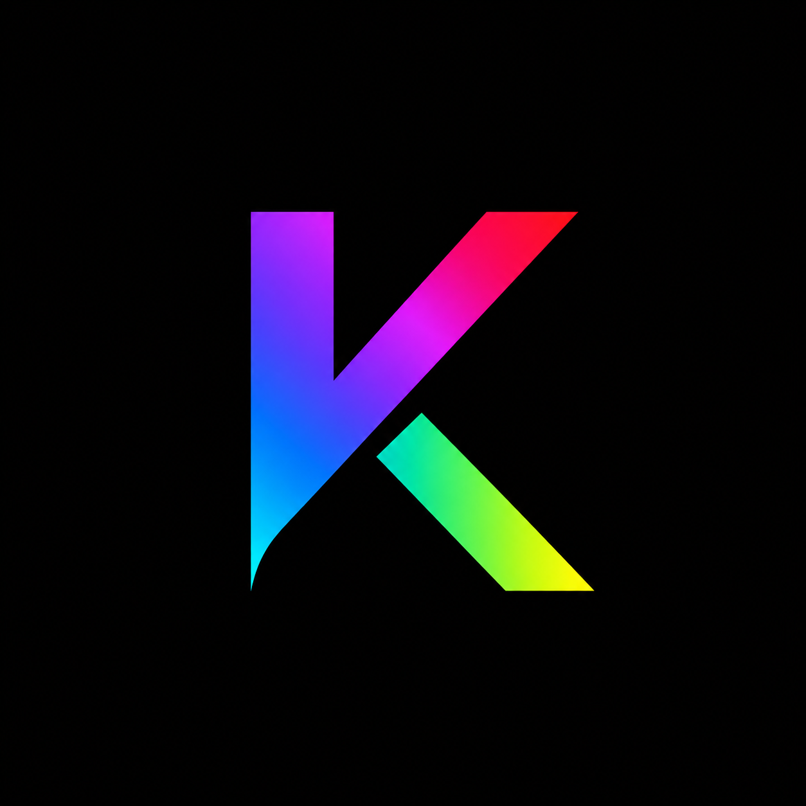

<div align="center">
  

  # KinovioTV

  **Seu cinema pessoal. Suas fontes. Uma interface que merece a tela inteira.**

  [](https://nuxt.com/)
  [](https://vuejs.org/)
  [](https://www.typescriptlang.org/)
  [](#estado-do-projeto)
</div>

---

O **KinovioTV** e um hub de midia pessoal para reunir filmes, series, animes, K-dramas, BLs e TV ao vivo a partir das fontes conectadas pelo proprio usuario.

Ele nao hospeda, distribui ou inclui filmes e series. O objetivo e organizar catalogos autorizados e bibliotecas pessoais em uma experiencia unica, bonita e agradavel de usar no celular, navegador e TV.

Em outras palavras: menos tempo procurando onde estava aquele episodio, mais tempo assistindo. A tecnologia finalmente fazendo o trabalho dela.

## O que ja existe

- Home cinematografica com destaques editoriais.
- Fileiras separadas para filmes, series, animes, K-dramas e BLs.
- Continuar assistindo, recomendacoes e Minha lista por perfil.
- Busca em fontes conectadas.
- Calendario responsivo de episodios e estreias.
- Paginas de detalhes, temporadas e episodios.
- Player com selecao de fontes e legendas.
- Perfis independentes e controle parental.
- Addons compativeis com o protocolo Stremio.
- Conexao com servidores Jellyfin.
- Playlists IPTV e TV ao vivo.
- Integracao opcional com TMDB e Trakt.
- Navegacao por toque, teclado e controle remoto.

## Experiencia

O design segue quatro principios simples:

1. **Conteudo primeiro:** configuracoes tecnicas ficam nas configuracoes, onde sempre deveriam estar.
2. **Movimento com sentido:** transicoes ajudam a entender para onde a interface foi.
3. **Mobile primeiro:** a experiencia principal funciona com uma mao; o player aproveita a paisagem.
4. **TV de verdade:** foco visivel, alvos grandes e navegacao previsivel a distancia.

A identidade utiliza preto profundo, superficies grafite e violeta como assinatura. O brilho aparece quando tem algo importante para dizer. Nao estamos iluminando uma pista de pouso.

## Tecnologias

| Camada | Tecnologia |
| --- | --- |
| Interface web | Nuxt, Vue e Tailwind CSS |
| API | Nitro server routes |
| Autenticacao | JWT e bcrypt |
| Persistencia | MongoDB com fallback local de desenvolvimento |
| Icones | Lucide |
| Metadados | TMDB e fontes conectadas pelo usuario |
| Catalogos | Addons compativeis com Stremio |
| Midia pessoal | Jellyfin e playlists IPTV |
| Android | Projeto Kotlin/Compose mantido em `android-tv/` |

## Como executar

Requisitos:

- Node.js 20 ou superior.
- MongoDB local ou uma URI de conexao valida.

```bash
git clone https://github.com/tiagomdss/KinovioTV.git
cd KinovioTV
npm install
```

Crie seu arquivo local de configuracao a partir de `.env.example`:

```env
MONGODB_URI=mongodb://127.0.0.1:27017/kinoviotv
JWT_SECRET=troque-por-um-segredo-longo-e-aleatorio
```

Inicie o ambiente de desenvolvimento:

```bash
npm run dev
```

O KinovioTV estara disponivel em `http://localhost:3001`.

Para validar uma versao de producao:

```bash
npm run build
npm run preview
```

## Fontes e privacidade

O KinovioTV foi pensado como agregador e player pessoal:

- Nenhum filme ou episodio acompanha o projeto.
- URLs, tokens e credenciais ficam fora do Git.
- O usuario e responsavel pelas fontes que conecta.
- Integracoes opcionais devem ser configuradas com credenciais proprias.
- O projeto deve ser utilizado apenas com conteudo pessoal, autorizado ou legalmente acessivel.

Nunca envie seu arquivo `.env`, tokens de servidores, chaves de API ou playlists privadas para o repositorio. O `.gitignore` ja ajuda, mas bom senso continua sendo uma dependencia obrigatoria.

## Estrutura principal

```text
KTV/
|-- app/
|   |-- components/       # Home, detalhes, player, busca e configuracoes
|   |-- assets/           # Tema global e identidade visual
|   `-- utils/            # Integracoes e navegacao espacial
|-- server/
|   `-- api/              # Autenticacao e sincronizacao
|-- public/               # Recursos publicos do produto
|-- android-tv/           # Aplicativo Android e Android TV
|-- nuxt.config.ts
`-- tailwind.config.js
```

## Estado do projeto

O KinovioTV esta em desenvolvimento ativo. A interface principal ja funciona, mas alguns recursos ainda precisam de testes amplos em dispositivos reais, principalmente reproducao, codecs, fontes externas, sincronizacao e navegacao por diferentes controles de TV.

### Proximas etapas

- Consolidar o fluxo completo entre detalhes, episodio e player.
- Melhorar selecao automatica e fallback de fontes.
- Finalizar calendario com dados reais por perfil.
- Expandir acessibilidade e idiomas RTL.
- Refinar perfis infantis, PIN e preferencias de reproducao.
- Testar layouts em celulares, tablets, navegadores e Android TV.
- Adicionar testes automatizados para os fluxos essenciais.

## Contribuindo

Issues e pull requests sao bem-vindos. Antes de contribuir:

1. Nao inclua conteudo protegido, credenciais ou listas privadas.
2. Preserve a navegacao por teclado e controle remoto.
3. Teste em viewport mobile antes de declarar que ficou responsivo.
4. Mantenha configuracoes tecnicas fora da Home. Essa regra ja aprendeu a voltar sozinha.

## Aviso

Este projeto nao e afiliado a Netflix, Disney, Max, Stremio, Jellyfin, TMDB, Trakt ou outros servicos mencionados. Marcas pertencem aos seus respectivos proprietarios.

Metadados podem ser fornecidos pelo [TMDB](https://www.themoviedb.org/). O KinovioTV nao e endossado ou certificado pelo TMDB.

---

<div align="center">
  <strong>KinovioTV</strong><br />
  Historias em movimento.
</div>
